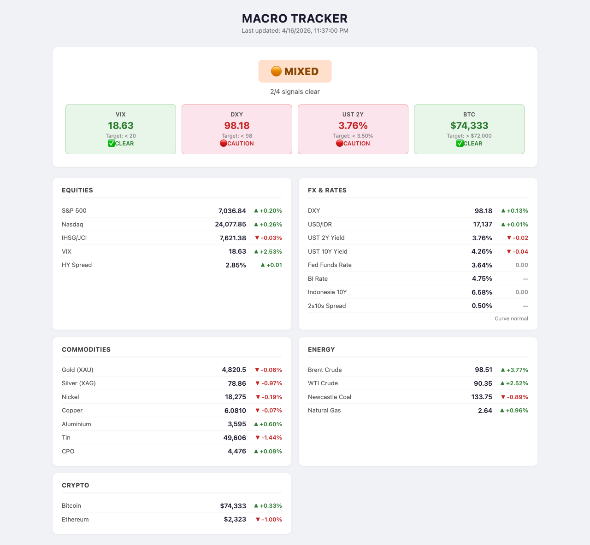
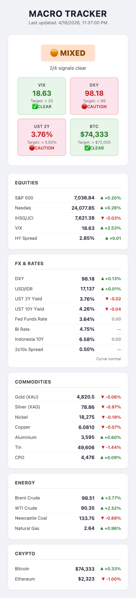

# Macro Tracker

Single-page macro situation dashboard tailored for an Indonesian investor. A Python script pulls daily market data (FX, rates, equities, commodities, energy, crypto) from Yahoo Finance, FRED, CoinGecko, and a pair of scraped sources, computes a 4-signal risk-on/off scorecard, and a static HTML file renders it.

No build step, no JS framework, no backend database. Python + HTML. Tooltips on every signal explain the reasoning.



**Live**: https://macro-tracker-production-340e.up.railway.app

---

## Philosophy

A macro tracker has one job: answer *"what's the macro vibe right now, and should I care?"* at a glance. Everything on the dashboard serves that question:

- **Hero verdict** (top) — one label that tells you the regime.
- **4 signals** — orthogonal measures (volatility, dollar, rates, credit) that produced the verdict. Hover any card for the rationale.
- **"Needs Your Attention"** — rule-based bullets for Indonesia-relevant moves (IDR, nickel, coal, CPO, tin, etc.). Suppressed when nothing notable happens.
- **Data cards + sparklines** — the underlying numbers with 30-day trend lines, so you can see *direction*, not just today's value.
- **Staleness banner** — warns if the scheduled refresh failed.

Signals were chosen to avoid the two common pitfalls of static macro dashboards:

1. **Arbitrary price thresholds** (e.g., "BTC > $72k") — they're anchored to one specific regime and age poorly.
2. **Lagging single-number indicators** — snapshots mean nothing without direction.

Every signal is either market-implied (VIX, HY spread) or a *spread/change* rather than a raw level (2Y-Fed, DXY 30-day trend), so the thresholds survive cycles.

## Signal scorecard

| Signal | Clear when | Why |
|--------|-----------|-----|
| **VIX** | `< 20` | Equity options' implied volatility. Above 20 = fear elevated, hedging dominant. Below 20 = market confident. Single best short-term gauge of risk appetite. |
| **DXY** | Dynamic: `< 99 AND 30d change < −0.5%` (fallback: `< 98`) | US dollar strength vs major currencies. A *weakening* dollar rotates capital to EM — so direction matters more than level. Static fallback used while `history.json` fills. |
| **2Y − Fed** | `< −0.25%` | UST 2Y minus Fed funds rate. Negative = market pricing rate cuts ahead (liquidity incoming). Self-adapts across hiking and cutting cycles, unlike a static 2Y threshold. |
| **HY Spread** | `< 3.50%` | ICE BofA high-yield spread over Treasuries. Bond market's direct risk-appetite gauge. Compressed = credit markets relaxed. Widening > 4.5% = default risk rising. |

Verdict labels by score:
- `4/4` → `FULL RISK-ON` (highest-conviction)
- `3/4` → `LEANING RISK-ON` (mostly constructive, watch the outlier)
- `2/4` → `MIXED` (no dominant direction)
- `1/4` or `0/4` → `RISK-OFF` (defensive regime)

Signal cards show a `FLIP` badge when the status changed overnight, computed from `history.json`.

## Needs Your Attention

Python rules generate bullets in this order of priority. Only rules whose thresholds are breached fire. If none fire, a generic regime summary is shown.

| Rule | Threshold | Why |
|------|-----------|-----|
| VIX elevated | `> 25` | Fear regime, defensive positioning warranted |
| IDR move | `\|24h\|` > 0.5% | Import costs, BI policy pressure |
| Nickel move | `\|24h\|` > 2% | Indonesia is #1 global producer |
| Coal move | `\|24h\|` > 2% | Top Indonesian export |
| CPO move | `\|24h\|` > 2% | Palm oil — Indonesian agri |
| Tin move | `\|24h\|` > 2% | Indonesia top global producer |
| Brent shock | `\|24h\|` > 3% | Fuel subsidy pressure, inflation |
| HY stress | `> 4.5%` | Credit stress, risk-off brewing |
| Aggressive cuts priced | `2Y-Fed < −0.5%` | Liquidity incoming |
| DXY trend | `\|30d\|` > 1.5% | EM tailwind/headwind |
| Scorecard flip | `prev ≠ today` | Regime change |

Capped at 5 bullets to keep the card focused.

## Dashboard features

- **Sparklines** — 30-day SVG trend line on every data row, colored by net direction (green up, red down). Pulled from `history.json`. Shows as a dashed placeholder when history is shallow.
- **Tooltips** — hover any signal card, verdict badge, or the Attention card for the reasoning.
- **Signal flip badges** — small `FLIP` pill on signal cards where the status changed since yesterday.
- **Staleness banner** — top-banner warning if `data.timestamp` > 6h (yellow) or > 24h (red, "scheduled refresh may have failed").
- **Responsive** — signal cards stack 2×2 on mobile; data cards single column.

## Architecture

```
macro-tracker/
├── fetch.py          # Thin orchestrator: loads history, fetches, writes data.json + history.json
├── common.py         # Shared constants (tickers, timeouts, history cap)
├── sources.py        # API clients (Yahoo Finance + chart backfill, FRED, CoinGecko)
├── scraping.py       # HTML scrapers (tradingeconomics.com, bi.go.id)
├── history.py        # Load/save, flatten snapshots, 30d Yahoo bootstrap, n-day % change helper
├── analysis.py       # Signal logic (incl. DXY dynamic) + Needs Your Attention rules
├── output.py         # Combines everything into the dashboard-facing JSON shape
├── index.html        # Single-file dashboard (inline CSS + JS)
├── server.py         # Lightweight server for hosted deploys (Railway/etc.)
├── Procfile          # Railway process type
├── railway.json      # Railway build/deploy config
├── data.json         # Current snapshot (gitignored)
└── history.json      # Rolling 30-day history, seeded from Yahoo on first run (gitignored)
```

**Data flow per run**:
```
history.json → loaded
  ↓
Yahoo crumb session → fetch_yahoo_finance (current) + fetch_yahoo_chart (30d bootstrap if history sparse)
  ↓
FRED → UST 2Y/10Y, Fed funds, HY spread
CoinGecko → BTC, ETH
TradingEconomics → LME nickel/tin, Newcastle coal, CPO, Indonesia 10Y
bi.go.id → BI rate
  ↓
analysis.compute_signals (uses history for DXY 30d trend)
analysis.generate_attention (rules fire on threshold breaches)
  ↓
output.build_output → data.json
flatten_snapshot(today) → append to history.json → trim to 30 days
```

On first run `history.json` is empty, so `bootstrap_history_from_yahoo` seeds ~30 days from the Yahoo `/v8/finance/chart` endpoint. This means sparklines and the DXY trend signal work from day 1, not day 30.

## Quick start (local)

```bash
git clone git@github.com:ad17-2/macro-tracker.git
cd macro-tracker

pip install -r requirements.txt

# Get a free FRED API key: https://fred.stlouisfed.org/docs/api/api_key.html
echo "FRED_API_KEY=your_key_here" > .env

python fetch.py
python -m http.server 8765
# Open http://localhost:8765/index.html
```

## Deploy to Railway

```bash
railway login
railway init --name macro-tracker
railway add --service macro-tracker
railway variables --set "FRED_API_KEY=your_key_here"
railway up
railway domain
```

The `server.py` entry point runs an initial fetch on startup, then re-fetches every `FETCH_INTERVAL_HOURS` (default 12). Dashboard served over HTTP on `$PORT`.

## CI/CD

`.github/workflows/deploy.yml` runs on every push to `main`:

1. **lint** job — `python -m compileall` + import check across every module
2. **deploy** job — installs Railway CLI, runs `railway up --service macro-tracker --detach --ci`

### One-time setup

1. In Railway dashboard: project → Settings → Tokens → **Create project token**
2. In GitHub repo: Settings → Secrets and variables → Actions → **New repository secret**
   - Name: `RAILWAY_TOKEN`
   - Value: (paste the Railway project token)
3. (Optional) Settings → Environments → create `production` environment to add required reviewers or wait timers before deploy.

Manual trigger available via Actions tab → *Deploy to Railway* → *Run workflow*.

## Automating daily refresh locally

```cron
0 18 * * 1-5 cd /path/to/macro-tracker && /usr/bin/python fetch.py >> /tmp/macro-tracker.log 2>&1
```

## Data sources

| Source | Auth | Coverage |
|--------|------|----------|
| [Yahoo Finance](https://finance.yahoo.com) | Crumb-based session (no API key) | Equities, FX, precious metals, copper, energy |
| [FRED API](https://fred.stlouisfed.org/docs/api/fred/) | Free API key | US rates, HY spread |
| [CoinGecko](https://www.coingecko.com/en/api) | None | BTC, ETH |
| [tradingeconomics.com](https://tradingeconomics.com) | Scraped tables | LME nickel/tin, Newcastle coal, CPO, Indonesia 10Y |
| [bi.go.id](https://www.bi.go.id) | Scraped HTML | BI rate |

Any failed source degrades gracefully — missing values show as `N/A`, script never crashes.

## Tweaking

- **Signal thresholds** — `analysis.py`, top of file (`DXY_*` constants) + inline comparisons in `compute_signals`.
- **Attention rules** — `analysis.py::generate_attention`, add/remove rules as needed.
- **Tickers** — `common.py::YAHOO_TICKERS` for API-based, `scraping.py::scrape_tradingeconomics` for scraped.
- **History window** — `common.py::HISTORY_DAYS` (default 30).
- **Colors / layout** — inline styles in `index.html`, no build step.

## Mobile



## License

MIT.
